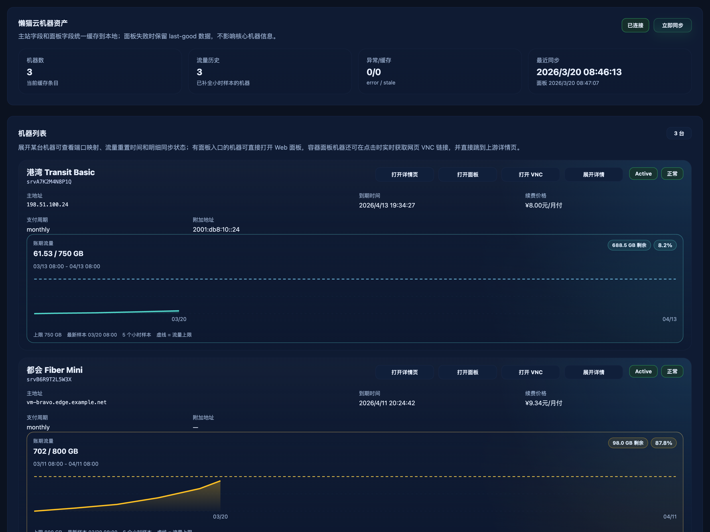
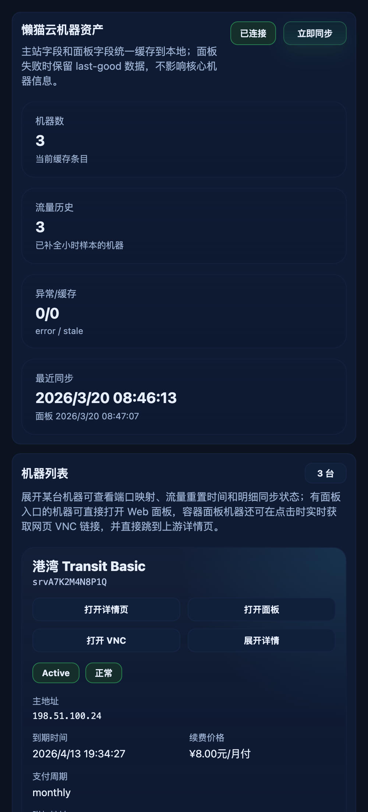

# 机器卡片：动作区上移与详情页入口（#4ttc3）

## 状态

- Status: 已完成
- Created: 2026-04-11
- Last: 2026-04-11

## 背景 / 问题陈述

现有 `#machines` 卡片已经支持“打开面板 / 打开 VNC / 展开详情”，但动作区仍独立占据标题下方一整行，导致桌面态信息密度偏低；同时用户仍需要自行回到上游站点才能打开机器详情页。

此前已完成的 `#za4kp` 与 `#j3zhd` 规格继续保持冻结，本次仅以 delta spec 追加：

- 桌面态卡片头部改为“标题块 / 动作区 / 状态徽标”三段式布局；
- 机器列表直接提供“打开详情页”入口；
- 小屏动作区改为稳定 2x2 网格，避免新增按钮后出现孤列或空洞。

## 目标 / 非目标

### Goals

- 机器卡片顶部动作区在桌面态上移到标题行内，并保持状态徽标仍在最右侧。
- `GET /api/lazycat/machines` 为每台机器返回显式 `detailUrl`，前端直接消费该字段。
- 新增“打开详情页”按钮，按机器 `serviceId` 打开对应上游详情页。
- 更新 Storybook 场景、交互断言与响应式验收，使四按钮布局可稳定复查。

### Non-goals

- 不改动懒猫云同步 cadence、面板抓取逻辑、VNC 解析链路。
- 不把详情页内嵌进 Catnap，不新增上游写操作。
- 不回写或重构既有 `#za4kp` / `#j3zhd` 已完成规格正文。

## 范围（Scope）

### In scope

- Rust：机器列表响应序列化补充 `detailUrl`，并按 `CATNAP_LAZYCAT_BASE_URL + serviceId` 生成上游详情页链接。
- Web：MachinesView 头部布局重排、新增详情按钮、响应式动作区调整。
- Storybook：MachinesView story 增补 autodocs、详情按钮交互断言与 responsive 覆盖。
- 文档：新增本 delta spec 与接口契约，沉淀最终视觉证据。

### Out of scope

- 数据库结构调整。
- 新的懒猫 API endpoint 或详情页抓取缓存。
- 任何与机器动作无关的 UI 重排。

## 接口契约（Interfaces & Contracts）

### 接口清单（Inventory）

| 接口（Name） | 类型（Kind） | 范围（Scope） | 变更（Change） | 契约文档（Contract Doc） | 负责人（Owner） | 使用方（Consumers） | 备注（Notes） |
| --- | --- | --- | --- | --- | --- | --- | --- |
| `GET /api/lazycat/machines.items[].detailUrl` | HTTP JSON field | public | Add | `contracts/http-apis.md` | backend | web | 由服务端显式生成，不要求前端推导 |
| MachinesView 头部动作区 | React page UI | internal | Modify | None | web | machines route / storybook | 桌面态并入标题行，小屏为 2x2 按钮网格 |
| MachinesView Storybook autodocs + play | Storybook contract | internal | Modify | None | web | UI review / regression | 覆盖四按钮顺序、链接打开与 responsive 行为 |

## 验收标准（Acceptance Criteria）

- Given 某台机器 `serviceId=2312`
  When 调用 `GET /api/lazycat/machines`
  Then 该条目包含 `detailUrl=https://lxc.lazycat.wiki/servicedetail?id=2312`。

- Given 桌面宽度下的机器卡片
  When 页面渲染完成
  Then 四个按钮全部位于标题行内，顺序固定为“打开详情页 / 打开面板 / 打开 VNC / 展开详情”，状态徽标仍位于最右侧。

- Given 用户点击“打开详情页”
  When 当前机器存在 `detailUrl`
  Then 前端必须以新窗口命中 Catnap 的同源 POST 详情桥接入口；桥接页必须自动登录并落到对应的上游详情页；若上游登录页先建立浏览器匿名会话，桥接页必须先在弹窗目标里执行一次真实 `GET /login` 再回放登录表单。

- Given 小屏宽度断点
  When 查看机器卡片动作区
  Then 四个按钮必须以 2x2 网格展示，不得横向溢出、遮挡或出现孤列。

- Given Storybook `MachinesView`
  When 执行 `play` 交互
  Then 能验证“打开面板 / 打开详情页 / 打开 VNC / 展开详情”的链接与行为顺序，并覆盖 responsive 断点验收。

## 非功能性验收 / 质量门槛（Quality Gates）

- `cargo test --all-features`
- `cd web && bun run typecheck`
- `cd web && bun run lint`
- `cd web && bun run test:storybook`

## 实现里程碑（Milestones）

- [x] M1: 新增 delta spec 与 `detailUrl` HTTP 契约
- [x] M2: 机器列表接口补 `detailUrl` 并覆盖 Rust/API 测试
- [x] M3: MachinesView 完成动作区重排、详情按钮与响应式 2x2 网格
- [x] M4: Storybook autodocs / play / 视觉证据完成并收敛到 merge-ready PR

## Visual Evidence

- source_type: storybook_canvas
  target_program: mock-only
  capture_scope: browser-viewport
  sensitive_exclusion: N/A
  story_id_or_title: Pages/MachinesView/Default
  state: desktop inline action row
  evidence_note: 桌面态机器卡片头部已收口为“标题块 / 动作区 / 状态徽标”三段式布局，四个按钮位于标题行内，顺序为“打开详情页 / 打开面板 / 打开 VNC / 展开详情”。
  image:
  PR: include
  

- source_type: storybook_canvas
  target_program: mock-only
  capture_scope: browser-viewport
  sensitive_exclusion: N/A
  story_id_or_title: Pages/MachinesView/Default
  state: mobile 2x2 action grid
  evidence_note: 小屏断点下动作区已改为稳定 2x2 网格，新增“打开详情页”后仍无横向溢出、无遮挡与孤列问题。
  image:
  PR: include
  

## 风险 / 假设

- 假设：`CATNAP_LAZYCAT_BASE_URL` 始终指向懒猫主站 origin，而不是 `/cart` 等子路径；若包含子路径，也应被归一化为 `/servicedetail?id=<serviceId>`。
- 风险：桌面态标题区同时容纳标题、四按钮与徽标，若宽度不足需要在中等断点自动折到第二行，否则可能出现拥挤。

## 变更记录（Change log）

- 2026-04-11: 创建 delta spec，冻结动作区上移、详情页入口与 responsive 验收口径。
- 2026-04-11: 机器列表响应新增 `detailUrl`，MachinesView 完成四按钮头部重排与小屏 2x2 动作网格。
- 2026-04-11: Storybook `MachinesView` 增补 autodocs、详情按钮交互断言与桌面/小屏视觉证据。
- 2026-04-15: 详情页桥接入口收紧为同源 POST；桥接页在上游登录依赖浏览器匿名会话时，会先 prime 一次真实 `GET /login` 再回放登录表单，避免浏览器缺失匿名会话 cookie。
