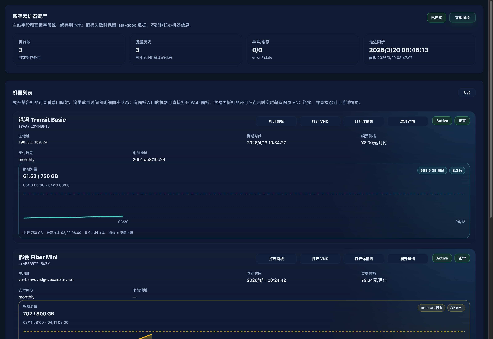
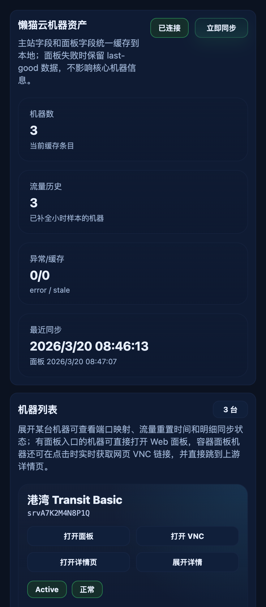

# 机器卡片：打开面板自动登录直达（#hcdnh）

## 状态

- Status: 部分完成（3/4）
- Created: 2026-04-11
- Last: 2026-04-11

## 背景 / 问题陈述

`#4ttc3` 已把机器卡片动作区收口为四按钮头部布局，但“打开面板”仍直接打开上次同步缓存下来的 `panelUrl`。当懒猫主站登录态过期、缓存入口缺少当前 live hash，或卡片只有 `panelKind=container` 但没有可直接使用的 `panelUrl` 时，用户仍需要自行回到懒猫站点重新登录后才能进入面板。

本次 follow-up 规格追加一条更接近“自动登录直达”的链路：点击“打开面板”时，由 Catnap 使用已保存的懒猫账号凭据实时校验登录态、必要时自动重登并刷新 live 面板入口，再把浏览器跳转到当前可用的容器 Web 面板地址。

## 目标 / 非目标

### Goals

- 为容器机器新增 live panel 跳转接口，点击“打开面板”时实时刷新面板入口并跳转。
- 当已保存的懒猫 cookies 失效但账号密码仍有效时，后端能自动重登并更新本地保存的 cookies / `lastAuthenticatedAt`。
- 前端“打开面板”按钮统一走 Catnap 自己的 POST redirect 入口，而不是直接打开缓存的 `panelUrl`。
- 对 `panelKind=container` 但 `panelUrl=null` 的卡片，仍允许尝试实时解析并打开面板。
- 更新 Storybook 交互断言，覆盖 live panel 打开行为与按钮可用性。

### Non-goals

- 不尝试把跨域懒猫站点 cookies 直接注入用户浏览器。
- 不改动“打开详情页”与“打开 VNC”的既有语义。
- 不新增懒猫写操作，不把面板 iframe 内嵌到 Catnap。

## 范围（Scope）

### In scope

- Rust：新增 live panel URL 解析与 redirect endpoint，并复用已保存账号自动重登。
- Web：MachinesView 的“打开面板”按钮改为走 Catnap redirect 入口；容器卡片无缓存 `panelUrl` 时也可点击。
- Tests：补充 stale cookie -> auto reauth -> live panel URL 的后端/API 覆盖。
- Storybook：更新 `MachinesView` 的交互断言，验证 panel 按钮现在走 POST redirect。

### Out of scope

- 懒猫浏览器主站会话共享。
- 面板入口的长期缓存策略重构。
- 新的 UI 布局调整。

## 接口契约（Interfaces & Contracts）

### 接口清单（Inventory）

| 接口（Name） | 类型（Kind） | 范围（Scope） | 变更（Change） | 契约文档（Contract Doc） | 负责人（Owner） | 使用方（Consumers） | 备注（Notes） |
| --- | --- | --- | --- | --- | --- | --- | --- |
| `POST /api/lazycat/machines/:service_id/panel-url` | HTTP JSON | public | Add | `contracts/http-apis.md` | backend | web/tests | 返回当前可用的 live panel URL |
| `POST /api/lazycat/machines/:service_id/panel` | HTTP redirect | public | Add | `contracts/http-apis.md` | backend | web/browser | 新窗口命中后 303 跳转到 live panel URL |
| MachinesView `打开面板` 交互 | React page UI | internal | Modify | None | web | machines route / storybook | 改为通过 Catnap 的 POST redirect 自动登录直达 |

## 验收标准（Acceptance Criteria）

- Given 某台容器机器的缓存 cookie 已失效，但保存的懒猫账号邮箱/密码仍有效
  When 调用 `POST /api/lazycat/machines/2312/panel-url`
  Then 服务端会自动重登懒猫账号、刷新并返回当前可用的 live panel URL，同时更新该账号的本地 cookies 与 `lastAuthenticatedAt`。

- Given 用户点击容器机器的“打开面板”
  When 浏览器允许弹窗
  Then 前端必须以新窗口命中 `/api/lazycat/machines/:serviceId/panel`，再由后端 303 跳转到上游 live panel URL。

- Given 某张卡片 `panelKind=container` 且 `panelUrl=null`
  When 页面渲染完成
  Then “打开面板”按钮仍为可点击状态，并尝试实时解析 live panel URL。

- Given 非容器机器
  When 页面渲染完成
  Then “打开面板”按钮继续保持禁用态。

- Given Storybook `MachinesView/VncAction`
  When 执行交互断言
  Then 能验证“打开面板”会创建新窗口并 POST 到 `/api/lazycat/machines/:service_id/panel`，而不是直接 `window.open(cachedPanelUrl)`。

## 非功能性验收 / 质量门槛（Quality Gates）

- `cargo test --all-features`
- `cd web && bun run typecheck`
- `cd web && bun run lint`
- `cd web && bun run test:storybook`

## 实现里程碑（Milestones）

- [x] M1: 新增 live panel URL/redirect 契约与 follow-up spec
- [x] M2: 后端面板自动重登 + redirect 接口与 API 测试完成
- [x] M3: 前端“打开面板”改为 live redirect，并更新 Storybook 交互覆盖
- [ ] M4: 质量门、视觉证据与 PR 再收敛完成

## Visual Evidence

- source_type: storybook_canvas
  target_program: mock-only
  capture_scope: browser-viewport
  sensitive_exclusion: N/A
  story_id_or_title: Pages/MachinesView/Default
  state: desktop action row after live panel redirect switch
  evidence_note: 本次改动不改变卡片视觉布局；桌面态复核显示“打开面板 / 打开 VNC / 打开详情页 / 展开详情”仍位于标题行内，其中“打开面板”现已切到实时校验登录态后的 live redirect 链路。
  image:
  PR: include
  

- source_type: storybook_canvas
  target_program: mock-only
  capture_scope: browser-viewport
  sensitive_exclusion: N/A
  story_id_or_title: Pages/MachinesView/Default
  state: mobile 2x2 action grid after live panel redirect switch
  evidence_note: 小屏断点下视觉布局保持稳定 2x2 动作区；“打开面板”在无缓存 `panelUrl` 的容器卡片上仍然可点击，说明交互语义切换没有破坏现有响应式布局。
  image:
  PR: include
  

## 风险 / 假设

- 假设：懒猫容器信息页依然能在登录后解析出包含 `hash` 的 live panel URL。
- 风险：若上游登录成功后不再提供面板链接，本次能力只能回退为错误页，不会伪造浏览器跨域登录态。

## 变更记录（Change log）

- 2026-04-11: 创建 follow-up spec，冻结“打开面板自动登录直达”的接口与交互验收口径。
- 2026-04-11: 后端新增 live panel URL / redirect 入口，并在 stale cookie 场景下自动重登后刷新保存的 cookies。
- 2026-04-11: 前端“打开面板”切换为 POST redirect，新窗口改由 Catnap 代解析 live panel URL；Storybook 交互断言与视觉证据已更新，本地质量门通过，待 push / PR 再收敛。
