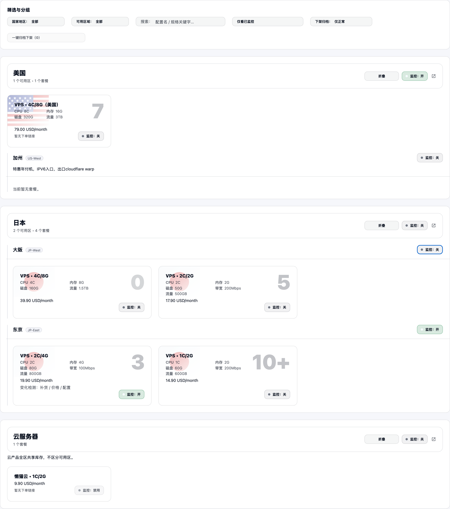

# 国家说明与可用区说明边界修复（#j3m9u）

## 状态

- Status: 部分完成（3/4）
- Created: 2026-03-13
- Last: 2026-03-13

## 背景 / 问题陈述

- “全部产品”页当前会把 `regionId = null` 的说明挂在国家标题下，即使该国家实际已经存在真实可用区。
- 当同一国家下的可用区块也展示自己的说明时，界面会出现国家头部与可用区块重复/错位展示同一段文案，用户容易误解为“国家说明”。
- “库存监控”页沿用同一份 `regionNotices` 数据，也需要与产品页保持一致的展示边界。

## 目标 / 非目标

### Goals

- 统一 products / monitoring 两页的说明展示规则：只要某国家在 `catalog.regions` 中存在任意真实可用区，就隐藏该国家的 `regionId = null` 说明。
- 保留可用区块自己的说明展示，不影响 `regionId != null` 的 notice。
- 对没有任何可用区的国家，继续允许显示 country-scoped 说明，避免误删真实国家级提示。
- 补齐 Storybook 场景与断言，覆盖“国家 root notice + 可用区 notice 同时存在”的边界。

### Non-goals

- 不修改后端抓取、`regionNotices` API shape、数据库或通知逻辑。
- 不调整说明文案内容、样式或 region block 的布局层级。
- 不改变监控开关、筛选、折叠、国家/可用区分组语义。

## 范围（Scope）

### In scope

- `web/src/App.tsx`：抽出共享的 notice 可见性判定，并在 ProductsView / MonitoringView 统一应用。
- `web/src/stories/pages/ProductsView.stories.tsx`：增加“国家误挂说明”场景，断言国家头部隐藏、可用区块保留。
- `web/src/stories/pages/MonitoringView.stories.tsx`：增加同类场景，断言监控页边界一致。
- `docs/specs/README.md`：登记本 follow-up spec。

### Out of scope

- Rust backend、抓取 fixture、真实截图采集。
- 库存监控页面的卡片统计与空态文案。

## 验收标准（Acceptance Criteria）

- Given 某国家在 `bootstrap.catalog.regions` 中存在至少一个 region
  When products 页渲染该国家块
  Then 不显示该国家 `regionId = null` 的 notice，但对应 region block 的 notice 继续显示。

- Given 某国家在 `bootstrap.catalog.regions` 中存在至少一个 region
  When monitoring 页渲染 `regionId = null` 的国家级监控 section
  Then 不显示 country-scoped notice；同一国家的 region-level section 仍显示对应 notice。

- Given 某国家在 topology 中没有任何 region
  When products / monitoring 页渲染该国家的 `regionId = null` 分组
  Then 该 country-scoped notice 仍正常显示。

- Given Storybook 边界场景
  When 执行 play 断言
  Then 能验证“有可用区的国家隐藏国家说明、无可用区国家保留说明”的行为。

## 非功能性验收 / 质量门槛（Quality Gates）

- `cd web && bun run lint`
- `cd web && bun run typecheck`
- `cd web && bun run test:storybook`

## Visual Evidence (PR)

- source_type: storybook_canvas
  target_program: mock-only
  capture_scope: element
  sensitive_exclusion: N/A
  submission_gate: pending-owner-approval
  story_id_or_title: Pages/ProductsView/PartitionMonitoringFocus
  state: country-notice-suppressed
  evidence_note: 验证 products 页中“美国”国家头部不再显示误挂的说明，而“加州”可用区块继续显示该说明；无可用区的“云服务器”仍保留国家说明。
  image:
  

- source_type: storybook_canvas
  target_program: mock-only
  capture_scope: element
  sensitive_exclusion: N/A
  submission_gate: pending-owner-approval
  story_id_or_title: Pages/MonitoringView/CountryNoticeFollowsRegionBoundary
  state: country-notice-suppressed
  evidence_note: 验证 monitoring 页国家级分组不再显示误归属说明，而“美国 / 加州”分组保留说明；无可用区国家仍保留 country-scoped notice。
  image:
  

## 实现里程碑（Milestones）

- [x] M1: 冻结 follow-up spec 与索引
- [x] M2: 完成 products / monitoring 共享 notice 边界修复
- [x] M3: 完成 Storybook 边界场景与断言
- [ ] M4: 完成 fast-track 收口（验证 / PR / checks / review-loop）

## 风险 / 假设

- 风险：若未来后端开始显式区分 country notice 与 region notice，本规则需要重新评估，避免前端 suppress 掩盖新的真实国家级说明。
- 假设：当前 `regionId = null` notice 在“存在真实可用区的国家”上应视为误归属的默认可用区说明，而不是独立国家说明。

## 变更记录（Change log）

- 2026-03-13: 创建 follow-up spec，冻结国家说明与可用区说明的展示边界。
- 2026-03-13: 完成前端 suppress 逻辑与 Storybook 边界断言，等待 PR / checks / review-loop 收口。
- 2026-03-13: 补充 Storybook mock 视觉证据到 spec，等待主人确认是否提交截图变更。
