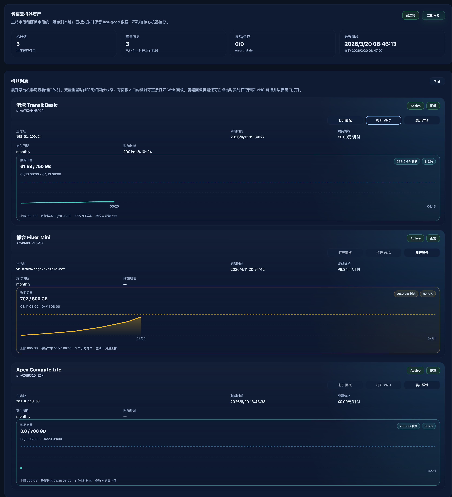

# 机器资产：VNC 新窗口按钮（#j3zhd）

## 状态

- Status: 已完成
- Created: 2026-03-21
- Last: 2026-03-21

## 背景 / 问题陈述

当前 `#machines` 页面只支持展开机器详情查看懒猫容器面板信息。若某台机器已经存在可用的网页 VNC / 容器面板入口，用户仍需要先进入上游详情页，再从面板里跳转，操作链路过长。

## 目标 / 非目标

### Goals

- 在机器列表卡片中提供“打开面板”和“打开 VNC”按钮，并以新窗口/新上下文打开真实网页入口。
- “打开面板”直接使用当前缓存中的 Web 面板 URL；“打开 VNC”在点击时实时解析控制台 URL。
- “打开 VNC”必须在点击时实时解析控制台 URL，并由浏览器直接跳转到上游网页 VNC 页面本身。
- 无需先展开详情，用户在列表层即可直接进入面板或 VNC。

### Non-goals

- 不把 noVNC / 终端控制台内嵌回主页面卡片本身。
- 不代理、镜像或转发上游控制台 HTML / WebSocket 内容。
- 不猜测懒猫第三方面板的私有 VNC 路由；只使用当前已缓存的容器面板网页入口。
- 不改动懒猫账号同步 cadence 或面板抓取策略。

## 范围（Scope）

### In scope

- `#machines` 机器卡片按钮与禁用态文案。
- 基于懒猫面板缓存字段的 Web 面板入口识别逻辑。
- 后端实时解析网页 VNC 控制台 URL 的 API。
- 后端一次性重定向入口，用于在点击时同步解析最新控制台 URL 并立即跳转。
- Storybook 场景覆盖“打开面板 / 打开 VNC / 无入口禁用”交互。

### Out of scope

- 为 NAT/容器面板补抓新的 VNC 元数据。

## 验收标准（Acceptance Criteria）

- Given 某台机器的最近一次成功缓存里包含容器面板入口 URL（如 `/container/dashboard?hash=...`）
  When 用户点击“打开面板”
  Then 前端必须以新窗口打开该网页 URL。

- Given 某台机器属于容器面板机器
  When 用户点击“打开 VNC”
  Then 前端必须以新窗口打开当前站点提供的一次性跳转入口；该入口在服务端实时解析 `/console?token=...` 后，立即把浏览器重定向到上游网页 VNC 页面本身。

- Given 上游控制台站点使用自签证书
  When 用户点击“打开 VNC”
  Then 当前站点仍必须把浏览器正确跳转到上游网页 VNC 页面；证书校验结果由浏览器直接针对上游站点处理。

- Given 某台机器没有可用的容器面板入口 URL
  When 用户查看机器列表
  Then 卡片仍显示“打开面板”和“打开 VNC”按钮，但按钮必须处于禁用态，且不会触发跳转。

- Given 某台机器 `detailState=stale`
  When 最近一次成功缓存中仍保留容器面板入口 URL
  Then “打开 VNC”按钮仍可使用，不要求详情重新同步成功。

## 非功能性验收 / 质量门槛（Quality Gates）

- Web: `bun run lint` + `bun run typecheck` + `bun run build` + `bun run test:storybook`
- 不引入机器卡片桌面端/移动端布局回退。
- 桌面端机器卡片不得因为右侧操作按钮而在标题和基础字段之间留下大面积空白。
- 移动端机器卡片操作区必须紧跟标题出现，基础字段至少保持两列紧凑排布，地址类长字段允许独占整行。
- 移动端状态标记必须继续固定在卡片标题行右上角，不得掉到操作按钮左侧或正文网格上方。

## 实现里程碑（Milestones）

- [x] M1: 冻结“只打开已缓存网页面板入口，不生成额外控制台 token”的交互边界
- [x] M2: 机器卡片增加 VNC 按钮、禁用态与新窗口打开行为
- [x] M3: Storybook 交互覆盖与本地 web 质量门通过

## 风险 / 假设

- 假设：懒猫缓存里的 `panel_url` 已经是面向用户可直接打开的新窗口入口。
- 风险：上游面板 token 接口变化时，实时 VNC 跳转可能失效，需要同步调整服务端解析链路。

## Visual Evidence (PR)

- source_type: storybook_canvas
  target_program: mock-only
  capture_scope: browser-viewport
  sensitive_exclusion: N/A
  submission_gate: pending-owner-approval
  story_id_or_title: Pages/MachinesView/Vnc Action
  state: panel and vnc action availability
  evidence_note: 机器卡片在列表层同时展示“打开面板 / 打开 VNC / 展开详情”，并正确区分可点击与禁用状态。
  image:
  

## 变更记录（Change log）

- 2026-03-21: 初始化规格，并完成机器列表 VNC 按钮、禁用态和 Storybook 交互覆盖。
- 2026-03-21: 根据真实上游实现修正为网页面板入口，不再使用 `vnc://` deep link。
