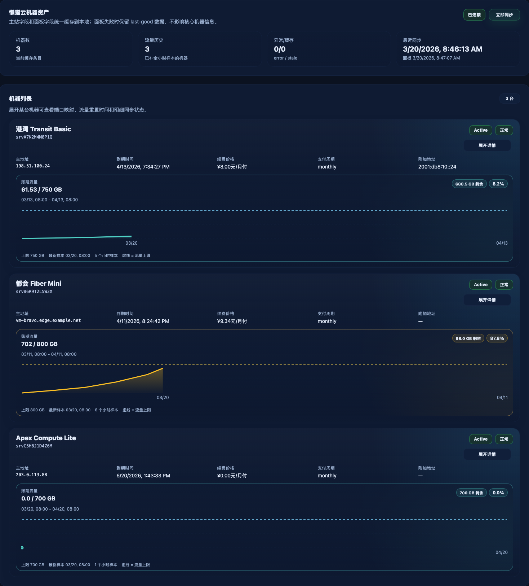
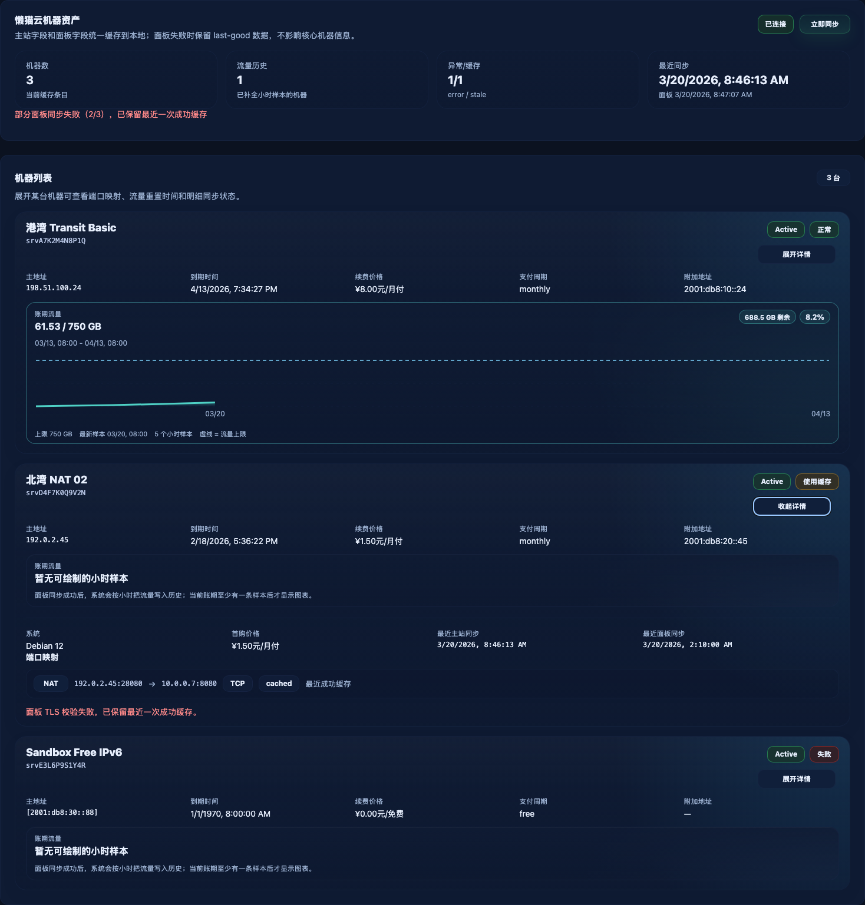

# 懒猫云账号接入与机器资产面板（#za4kp）

## 状态

- Status: 已完成
- Created: 2026-03-19
- Last: 2026-03-21

## 背景 / 问题陈述

- Catnap 当前只覆盖懒猫云购物车库存与上架监控，没有账号级机器资产视图。
- 用户已经在懒猫云主站有现成账号与多台机器，但需要频繁在主站、产品详情页和容器面板之间来回切换。
- 主站与容器面板的数据源分散，且部分容器面板存在无效 HTTPS 证书；如果不在服务端统一收口，前端无法稳定展示机器详情。

## 目标 / 非目标

### Goals

- 为每个 Catnap 用户新增 1 个懒猫云账号绑定能力，支持邮箱/密码登录、自动续会话、断开账号与立即同步。
- 新增 `#machines` 页面，展示缓存的机器资产：机器名、主 IP/域名、附加 IP、到期时间、支付周期、续费价格、端口映射、流量使用、重置时间与同步状态。
- 面板流量在同步成功后必须按小时写入历史缓存，机器页图表只展示当前账期的真实小时样本。
- 服务端统一抓取懒猫云主站与容器面板，前端只读取 Catnap 本地缓存 API。
- 主站 session 失效时自动重登并重试一次；面板抓取失败时保留核心机器缓存并显式标记 stale/error。

### Non-goals

- 不实现 root 密码/VNC/重装/开关机/购买/续费提交等写操作。
- 不做多懒猫账号并存，也不抽象通用“多云供应商”框架。
- 不修复第三方面板证书，只要求后端拉取时容忍无效 TLS/主机名。

## 范围（Scope）

### In scope

- 后端懒猫云账号表、机器缓存表、端口映射表与对应 API。
- 后端流量小时样本表，以及“当前账期历史”读取契约。
- 主站登录、cookie 持久化、分页发现服务、服务详情归一化、续费价格抓取。
- 普通容器机面板 hash 提取、流量信息抓取、IPv4/IPv6 端口映射抓取。
- NAT 机 `nat_acl` 代理接口抓取与错误降级。
- `BootstrapResponse.lazycat` 摘要、设置页账号卡片、新增 `#machines` 路由与只读资产页。
- 后台自动同步：主站 5 分钟、面板 10 分钟、面板并发 2，登录成功立即同步。

### Out of scope

- 浏览器端直接请求懒猫云站点或容器面板。
- 账单历史、工单、余额、DNS、反代域名等与本次验收无关的信息展示。
- 用户级同步频率开关与多 provider UI 选择器。

## 需求（Requirements）

### MUST

- `BootstrapResponse` 必须新增 `lazycat` 摘要块：`connected`、`state`、`machineCount`、`lastSiteSyncAt`、`lastPanelSyncAt`、`lastError`。
- 新增 API：`GET /api/lazycat/account`、`POST /api/lazycat/account/login`、`DELETE /api/lazycat/account`、`POST /api/lazycat/sync`、`GET /api/lazycat/machines`。
- `POST /api/lazycat/account/login` 请求体固定为 `{ email, password }`；登录成功后保存凭据与主站 cookies，并触发立即同步。
- 主站核心数据固定来自 `/login?action=email`、`/clientarea?action=list&page=n`、`/host/dedicatedserver?host_id=<id>`、`/servicedetail?id=<id>&action=renew`。
- 普通容器机必须从 `/provision/custom/content?id=<id>&key=info` 提取 panel URL/hash，再调用 `/api/container/info` 与 `/api/container/port-mapping?version=v4|v6`。
- NAT 机必须优先使用 `/provision/custom/content?id=<id>&key=nat_acl&action=natlist`；失败时保留 last-good 端口缓存并标记 `detailState=error|stale`。
- 面板 URL 为 `https://` 且证书/主机名校验失败时，只允许对同 URL 重试一次“忽略 TLS 校验”；不得静默降级到 `http://`。
- 账号与机器缓存必须按 `X-User-Id` 隔离；断开账号时只清除当前用户的懒猫云账号、机器与端口映射数据。
- 普通容器机面板同步成功后，必须把流量快照按“每小时最多 1 条”的粒度写入历史表；同一小时只保留最新样本。
- `GET /api/lazycat/machines` 返回的图表数据必须来自数据库中的真实小时样本，不得由前端基于单次快照推导伪趋势。

### SHOULD

- 登录态状态机尽量明确区分 `authenticating`、`syncing`、`ready`、`error`。
- 机器详情页应当优先展示主站核心字段，即使面板失败也不影响机器列表可见。
- 面板/API 失败时应复用最近一次成功的端口映射与流量快照，并在 UI 中提示“使用缓存”。
- 续费价格优先使用 renew modal 当前激活周期金额；缺失时回退 `amount_desc`。

## 功能与行为规格（Functional/Behavior Spec）

### Core flows

- 账号绑定：
  - 用户在设置页输入懒猫云邮箱/密码并点击连接。
  - 后端先抓登录页 token，再 `POST /login?action=email` 完成登录，保存 cookies 与账号状态。
  - 登录成功后立即触发一次主站全量同步，并继续排队面板补全。
- 后台同步：
  - poller 周期性扫描已绑定懒猫云账号的用户。
  - 若距 `lastSiteSyncAt` 超过 5 分钟，则同步主站机器列表与核心详情。
  - 若距 `lastPanelSyncAt` 超过 10 分钟，则按并发 2 补全容器面板/NAT 详情。
  - 每次容器面板同步成功后，服务端按小时刷新该机器当前账期的流量历史样本。
- 机器列表：
  - 前端进入 `#machines` 后调用 `GET /api/lazycat/machines` 读取缓存。
  - 页面按机器卡片/表格展示状态、地址、计费、到期、流量、端口映射与同步状态。
  - 未绑定账号时展示引导，不报错。
- 立即同步：
  - 设置页与机器页都可以触发 `POST /api/lazycat/sync`。
  - API 只排队/执行一次当前用户的全量同步，不改凭据。

### Error handling / edge cases

- 主站 session 失效时，服务端必须用已保存邮箱/密码自动重登并重试一次当前请求。
- 若自动重登仍失败，账号 `state=error`，但 last-good 机器缓存必须保留。
- 若主站页只返回登录页 HTML，必须视为未登录，而不是把登录页误解析为机器列表。
- 若 NAT 代理返回 `{"code":500,"msg":"连接服务器失败"}`，不得清空现有 NAT 端口映射缓存。
- 若容器面板 `GET /api/container/info` 或 `port-mapping` 失败，机器仍展示核心字段，面板区标记 `detailState=error|stale`。

## 接口契约（Interfaces & Contracts）

### 接口清单（Inventory）

| 接口（Name） | 类型（Kind） | 范围（Scope） | 变更（Change） | 契约文档（Contract Doc） | 负责人（Owner） | 使用方（Consumers） | 备注（Notes） |
| --- | --- | --- | --- | --- | --- | --- | --- |
| Bootstrap lazycat summary | HTTP API | internal | Modify | ./contracts/http-apis.md | backend | web | 首页导航与设置页首屏状态 |
| Lazycat account APIs | HTTP API | internal | New | ./contracts/http-apis.md | backend | web | 登录、查看、断开、立即同步 |
| Lazycat machines API | HTTP API | internal | New | ./contracts/http-apis.md | backend | web | 返回缓存机器与端口/流量详情 |
| Lazycat account storage | DB | internal | New | ./contracts/db.md | backend | backend | 懒猫云凭据、cookies、同步状态 |
| Lazycat machine cache | DB | internal | New | ./contracts/db.md | backend | backend | 核心机器字段 + panel/NAT 补全摘要 |

### 契约文档（按 Kind 拆分）

- [contracts/README.md](./contracts/README.md)
- [contracts/http-apis.md](./contracts/http-apis.md)
- [contracts/db.md](./contracts/db.md)

## 验收标准（Acceptance Criteria）

- Given 用户提供有效懒猫云邮箱/密码
  When 调用 `POST /api/lazycat/account/login`
  Then 返回已连接账号视图，并在短时间内把状态从 `authenticating/syncing` 收敛到 `ready`。

- Given 当前用户已绑定懒猫云账号
  When 调用 `GET /api/lazycat/machines`
  Then 返回当前用户缓存机器列表，至少包含机器名、主 IP/域名、附加 IP、到期时间、支付周期、续费价格。

- Given 某台机器是普通容器机
  When 面板抓取成功
  Then 响应必须包含流量已用值、流量上限、重置日、最近重置时间与 IPv4/IPv6 端口映射。

- Given 某台普通容器机已经跨多个小时完成面板同步
  When 调用 `GET /api/lazycat/machines`
  Then 当前账期的流量图表数据必须包含真实小时样本，并明确给出 `cycleStartAt/cycleEndAt` 范围。

- Given 主站 session 失效
  When 后台同步或手动同步触发
  Then 服务端自动重登并重试一次；若仍失败，保留 last-good 缓存并把账号或机器标记为 `error/stale`。

- Given 某台机器面板证书无效或 NAT 代理不可达
  When 补全面板/NAT 详情
  Then 核心机器信息仍可见，详情区显示“同步失败/使用缓存”，不会导致整页失败。

- Given `u_1` 和 `u_2` 都在使用 Catnap
  When 分别读取懒猫云接口
  Then 两者的账号、cookies、机器缓存与端口映射完全隔离；断开账号只清当前用户数据。

## 实现前置条件（Definition of Ready / Preconditions）

- 每个 Catnap 用户最多绑定 1 个懒猫云账号：已确认。
- 懒猫云凭据可沿用现有 SQLite secret 存储模式：已确认。
- 自动同步 cadence 固定为主站 5 分钟、面板 10 分钟、面板并发 2：已确认。
- 前端只读取 Catnap 本地缓存 API，不直连懒猫云主站或面板：已确认。

## 非功能性验收 / 质量门槛（Quality Gates）

### Testing

- 后端解析单测覆盖登录 token、`clientarea` 分页服务发现、`host/dedicatedserver` 归一化、renew 价格解析、panel hash/traffic/port-mapping 解析。
- 后端集成测试覆盖登录/断开/多用户隔离/手动同步/自动重登/NAT 500 降级。
- 前端类型检查与构建必须覆盖新增 `#machines` 页面与设置页懒猫云卡片。

### Quality checks

- `cargo fmt`
- `cargo clippy --all-targets --all-features -- -D warnings`
- `cargo test --all-features`
- `cd web && bun run lint`
- `cd web && bun run typecheck`
- `cd web && bun run build`

## 文档更新（Docs to Update）

- `docs/specs/README.md`
- 本规格 contracts 文档
- 若接口/行为在 review 中收敛变更，必须同步 spec 状态与 Change log

## 实现里程碑（Milestones / Delivery checklist）

- [x] M1: 冻结懒猫云 API / DB 契约与运行时配置口径
- [x] M2: 完成主站登录、session 持久化、机器核心详情同步
- [x] M3: 完成容器面板/NAT 补全、自动重登与错误降级
- [x] M4: 完成 `/api/lazycat/*`、`BootstrapResponse.lazycat` 与后台调度
- [x] M5: 完成设置页账号卡片、`#machines` 页面、测试与质量门

## 方案概述（Approach, high-level）

- 后端新增独立 `lazycat` 模块，负责主站登录、cookie 管理、服务发现、详情抓取、容器面板访问与 NAT 降级。
- 数据层引入账号表 + 机器缓存表 + 端口映射表；前端和 bootstrap 只读这些缓存，不做直连。
- poller 在原有用户循环基础上增加懒猫云同步 cadence，保证自动同步与库存轮询共存。

## 风险 / 开放问题 / 假设（Risks, Open Questions, Assumptions）

- 风险：懒猫云主站或面板 HTML 结构变化会影响 parser，需要 fixture 单测兜底。
- 风险：部分 NAT 产品接口本身不稳定，可能长期只能展示核心字段与旧缓存。
- 风险：面板忽略 TLS 校验属于高风险能力，必须严格限制为主站返回的同机 panel URL。
- 风险：现有同步 cadence 为 10 分钟，小时采样依赖面板成功返回；若面板持续失败，图表会停留在上一次成功样本。
- 需要决策的问题：None。
- 假设（需主人确认）：None。

## Visual Evidence (PR)

- source_type: storybook_canvas
  target_program: mock-only
  capture_scope: element
  sensitive_exclusion: N/A
  submission_gate: approved
  story_id_or_title: Pages/MachinesView/Default
  state: default with hourly traffic history
  evidence_note: 验证机器资产页默认展示态，证明列表项中的流量图表基于当前账期真实小时样本渲染，并保留流量上限虚线与账期范围标签。
  image:
  

- source_type: storybook_canvas
  target_program: mock-only
  capture_scope: element
  sensitive_exclusion: N/A
  submission_gate: approved
  story_id_or_title: Pages/MachinesView/Partial Failure
  state: partial failure expanded detail
  evidence_note: 验证面板失败降级态，证明 stale/error 汇总、展开详情、缓存端口映射与 TLS 失败提示会同时展示且不影响主列表可见。
  image:
  

## 变更记录（Change log）

- 2026-03-19: 创建规格，冻结懒猫云账号接入、机器缓存、面板补全与前端页面口径。
- 2026-03-19: 完成懒猫云后端同步模块、`/api/lazycat/*`、设置页账号卡片、`#machines` 页面，以及解析/隔离/断开相关测试与质量门。
- 2026-03-21: 刷新 Storybook 视觉证据，补充当前默认态与部分失败态截图。
- 2026-03-21: 补充流量小时样本历史要求，明确图表只能消费数据库中的真实账期样本。
